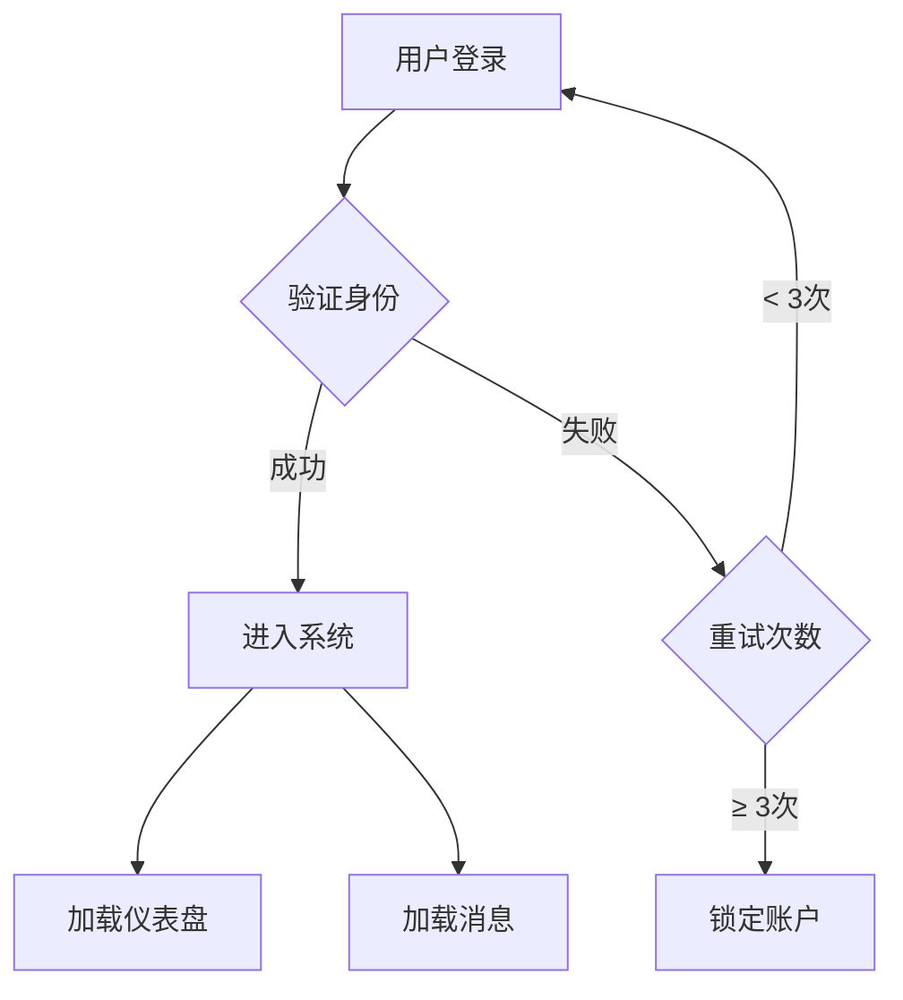
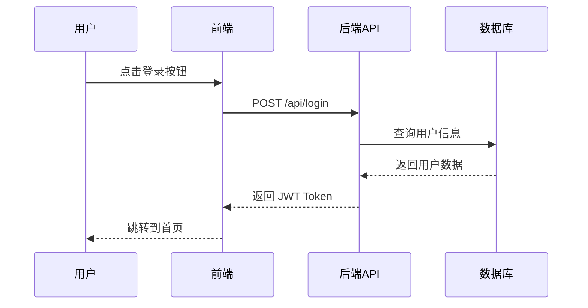
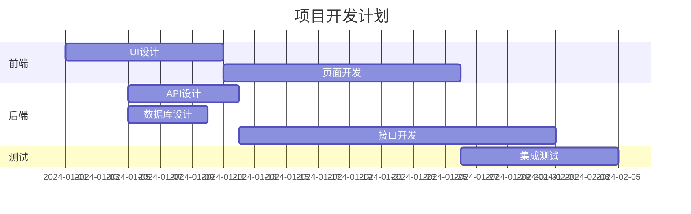
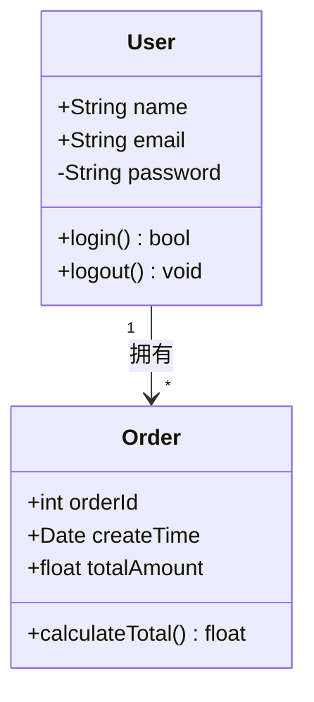

# [以下是测试]

---

## 1. 代码块测试

### Python 代码（带注释和类型提示）
```python
import numpy as np
from typing import List, Tuple

def fibonacci(n: int) -> List[int]:
    """生成斐波那契数列"""
    if n <= 0:
        return []
    seq = [0, 1]
    for i in range(2, n):
        seq.append(seq[i-1] + seq[i-2])
    return seq[:n]

# 测试
result = fibonacci(10)
print(f"前10项: {result}")  # 输出: [0, 1, 1, 2, 3, 5, 8, 13, 21, 34]
```

### JavaScript 代码（ES6+）
```javascript
class EventEmitter {
  constructor() {
    this.events = new Map();
  }
  
  on(event, listener) {
    if (!this.events.has(event)) {
      this.events.set(event, []);
    }
    this.events.get(event).push(listener);
    return () => this.off(event, listener);
  }
  
  emit(event, ...args) {
    const listeners = this.events.get(event) || [];
    listeners.forEach(fn => fn(...args));
  }
}

// 使用示例
const emitter = new EventEmitter();
emitter.on('data', (msg) => console.log(`收到: ${msg}`));
```

### SQL 查询
```sql
WITH ranked_orders AS (
  SELECT 
    customer_id,
    order_date,
    amount,
    ROW_NUMBER() OVER (PARTITION BY customer_id ORDER BY order_date DESC) AS rn
  FROM orders
  WHERE order_date >= '2024-01-01'
)
SELECT customer_id, order_date, amount
FROM ranked_orders
WHERE rn <= 3;
```

### Shell 脚本
```bash
#!/bin/bash
for file in *.log; do
    count=$(grep -c "ERROR" "$file")
    if [ "$count" -gt 100 ]; then
        echo "⚠️  $file 包含 $count 个错误"
    fi
done
```

---

## 2. 数学公式测试

### 行内公式
质能方程：$E = mc^2$，勾股定理：$a^2 + b^2 = c^2$

### 块级公式（LaTeX）

**傅里叶变换：**
$$
\mathcal{F}(\omega) = \int_{-\infty}^{\infty} f(t) \, e^{-2\pi i \omega t} \, dt
$$

**贝叶斯定理：**
$$
P(A|B) = \frac{P(B|A) \cdot P(A)}{P(B)}
$$

**矩阵运算：**
$$
\begin{bmatrix}
a_{11} & a_{12} & \cdots & a_{1n} \\
a_{21} & a_{22} & \cdots & a_{2n} \\
\vdots & \vdots & \ddots & \vdots \\
a_{m1} & a_{m2} & \cdots & a_{mn}
\end{bmatrix}
\begin{bmatrix}
x_1 \\ x_2 \\ \vdots \\ x_n
\end{bmatrix}
=
\begin{bmatrix}
b_1 \\ b_2 \\ \vdots \\ b_m
\end{bmatrix}
$$

**极限与求和：**
$$
\lim_{n \to \infty} \sum_{k=0}^{n} \frac{1}{k!} = e
$$

---

## 3. Mermaid 图表测试

### 流程图（Flowchart）


### 时序图（Sequence Diagram）


### 甘特图（Gantt Chart）


### 类图（Class Diagram）


---

## 4. 表格测试

| 方法 | 路径 | 描述 | 认证 |
|------|------|------|------|
| GET | `/api/users` | 获取用户列表 | Bearer Token |
| POST | `/api/users` | 创建新用户 | Bearer Token |
| PUT | `/api/users/:id` | 更新用户信息 | Bearer Token |
| DELETE | `/api/users/:id` | 删除用户 | Admin |

---

## 5. 文本格式测试

**粗体文本**、*斜体文本*、~~删除线~~、`行内代码`

> 这是一段引用文本。可以包含多行内容，用于展示引用的渲染效果。
> 
> —— *某位名人*

- [x] 已完成任务
- [ ] 未完成任务
- [ ] 待办事项

---

## 6. 分隔线测试

内容 A

---

内容 B

***

内容 C

---

如果以上所有内容都能正常渲染，说明你的软件对 Markdown、代码高亮、数学公式和 Mermaid 图表的支持都比较完善！
